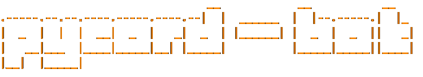

[](https://www.codefactor.io/repository/github/timmypidashev/pycord-bot-template)
[](https://discord.gg/EDRjZdkGBG)
[](https://pypi.python.org/pypi/py-cord)
[](https://wakatime.com/badge/user/b920b284-3cde-4cd4-b72e-f7f22d050b16/project)


## Features:
### Colorful logging


### Asynchronous sqlite database


### And to top it all off, it also doubles as a great slash command bot template!

## Installation
* Clone the repository recursively or click the [Use this template](https://github.com/timmypidashev/pycord-bot-template/generate) button!
```bash
git clone --recursive https://github.com/timmypidashev/pycord-bot-template
```

* Run `configure.sh` to install the necessary dependencies:
```bash
cd pycord-bot-template
chmod +x configure.sh
./configure.sh
```

* Rename the `.env_example` to **.env**
```bash
mv .env_example .env
```

* Change the environment variables as instructed in the `.env` file.

* Run the bot:
```bash
clear; python3 client.py
```

Thats it! If you like what you see, then consider joining my [discord server](https://discord.gg/EDRjZdkGBG) :)
